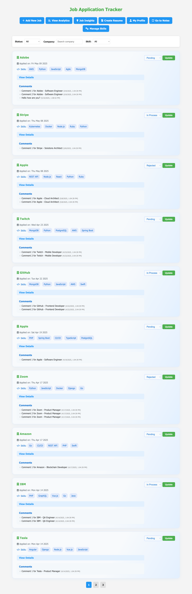
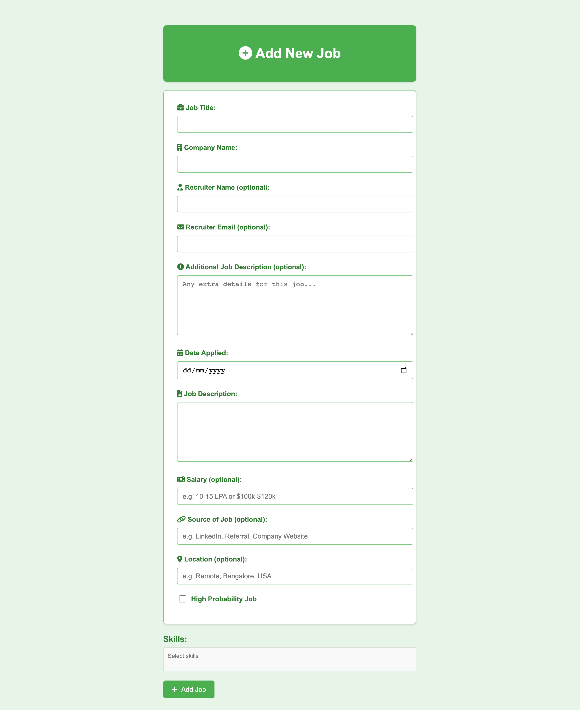
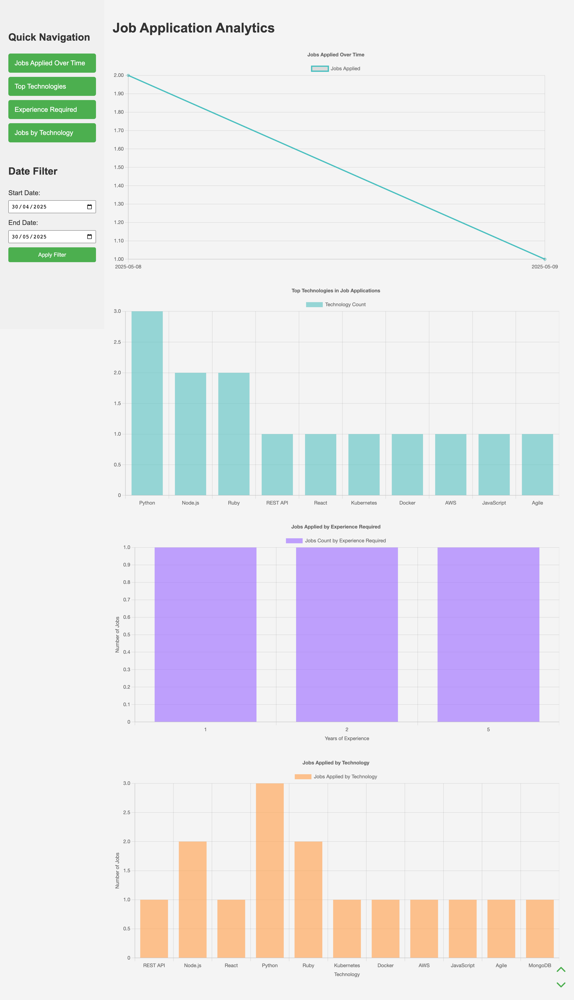
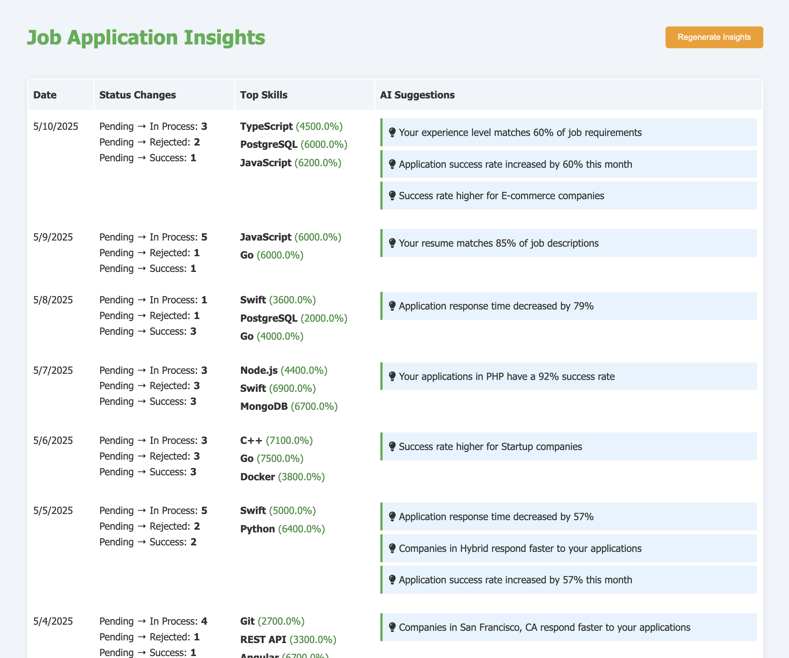
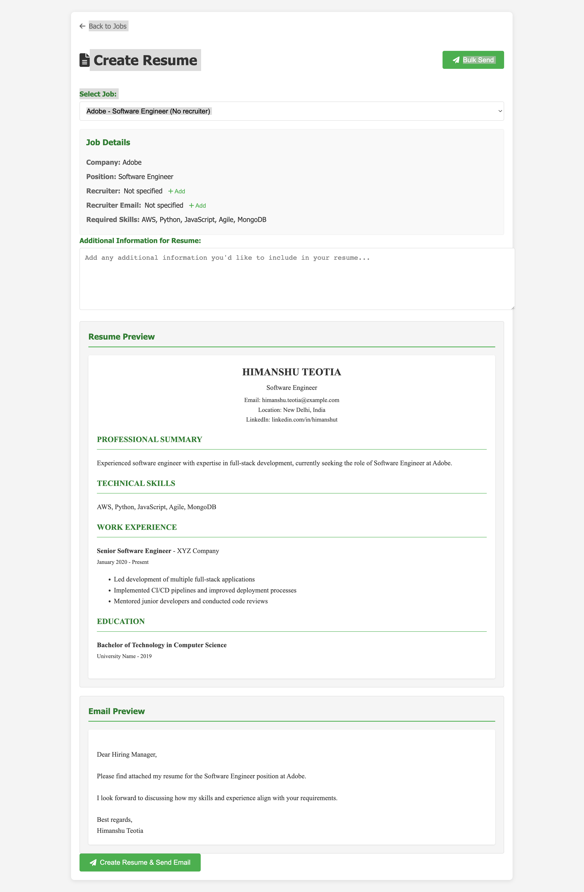
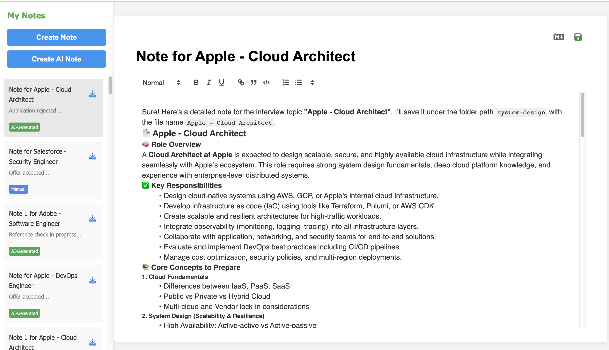
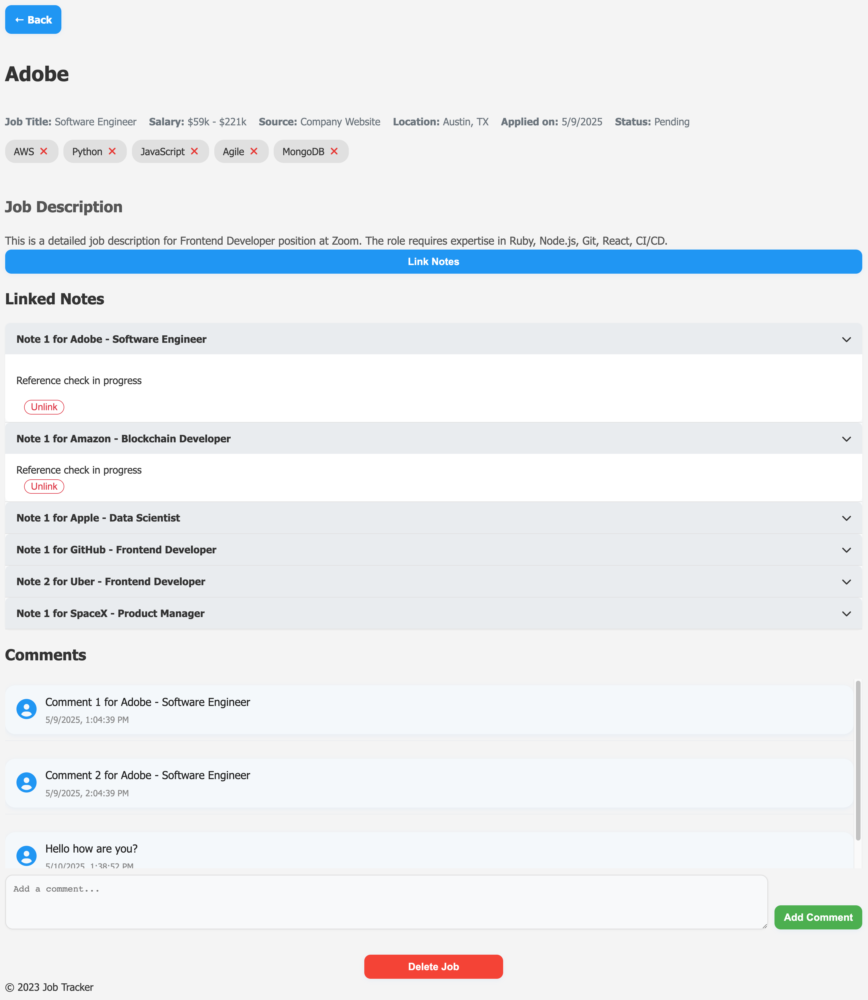
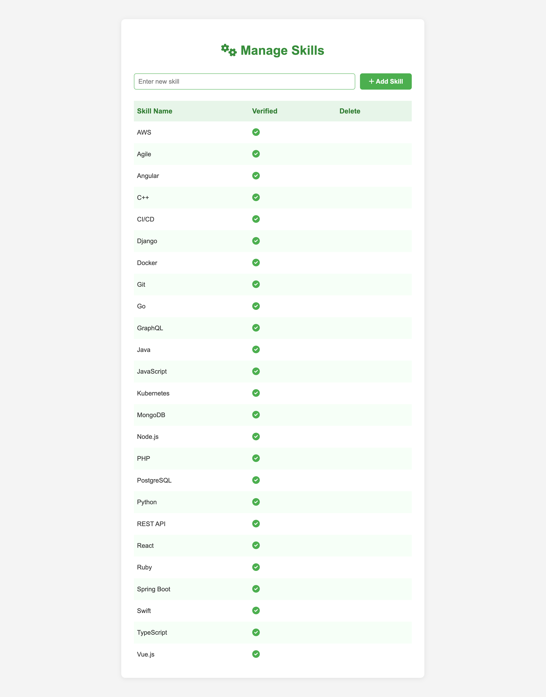

# Job Application Tracker

## Features

- User authentication (login/signup)
- Add, view, edit and delete job applications
- Add notes for each job application
- Responsive design

## Installation

1. Clone the repository:
   ```
   git clone https://github.com/himanshuteotia/job-application-tracker.git
   ```
2. Install dependencies:
   ```
   npm install
   ```
3. Set environment variables:
   ```
   cp .env.example .env
   ```
   Then add your database credentials and session secret to the .env file.

4. Run database migrations:
   ```
   npm run migrate
   ```
5. Start the server:
   ```
   npm start
   ```

## Usage

1. Go to `http://localhost:3000` in your browser
2. Sign up or login
3. Add, view, edit or delete job applications on the dashboard
4. Add notes for each job application

## Folder Structure

- `models/`: Database models
- `views/`: EJS templates
- `public/`: Static files (CSS, client-side JS)
- `routes/`: Express routes
- `docs/`: Feature-specific documentation

For more details, check the README files for each feature in the `docs/` folder.

## Contributing

Contributions are welcome! Please create an issue or comment on an existing issue before starting work on a PR.

## License

ISC License

## Insights & Analytics System

This project includes a daily insights system that analyzes your job application data and provides actionable analytics and AI-powered suggestions. The insights are calculated and stored automatically every day using a cron job.

### What is Tracked?
- **Status Transitions:**
  - Tracks how many jobs moved from Pending to In Process, Rejected, or Success each day.
  - Uses a `statusHistory` array in each Job document to accurately track all status changes over time.
- **Technology Success Rate:**
  - For each skill/technology, calculates how many jobs used that skill and how many of those were successful (status = Success).
  - Shows which skills are most effective for your job search.
- **AI Suggestions:**
  - Based on your application history, the system suggests which skills or areas you should focus on to improve your chances of success.

### How Does It Work?
- Every day, a cron job runs and:
  1. Fetches all jobs from the database.
  2. Analyzes status transitions using the `statusHistory` field.
  3. Calculates technology success rates.
  4. Generates AI suggestions based on your data.
  5. Saves a new document in the `insights` collection with all this information.
- The Insights page always shows the latest daily insights.

### Cron Job Setup
- The cron job is configured using the `node-cron` package.
- The schedule for the cron job is set in the `.env` file using the `INSIGHTS_CRON_SCHEDULE` variable (e.g., `0 2 * * *` for every day at 2 AM).
- You can change the schedule as needed.

### Example .env Entry
```
INSIGHTS_CRON_SCHEDULE=0 2 * * *
```

### Extending Insights
- You can add more analytics, suggestions, or custom logic by editing the helpers in `utils/insightHelpers.js` and the cron job script.

Images :

















